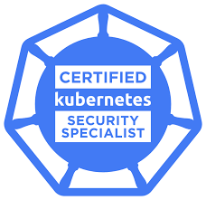

<h1 align="center">Kubernetes - CKS</h1>

  
  

  <a href="#-projeto">Projeto</a>&nbsp;&nbsp;&nbsp;|&nbsp;&nbsp;&nbsp;
  <a href="#-tecnologias">Tecnologias</a>&nbsp;&nbsp;&nbsp;|&nbsp;&nbsp;&nbsp;
  <a href="#-roadmap">Roadmap</a>&nbsp;&nbsp;&nbsp;|&nbsp;&nbsp;&nbsp;
  <a href="#-referências">Referências</a>

  

## Roadmap

| Tema | Progresso |
|---|---|
| Cluster Setup |  |
| Cluster Hardening |  |
| Minimize Microsservice Vulnerabilities |  |
| System Hardening |  |
| Supply Chain Security |  |
| Monitoring, Logging and Runtime Security |  |

| Progresso |
| --- |
|  |
|  |
|  |
|  |
|  |
|  |

## 📄 Referências

- A certificação CKA (não expirada) é necessária para fazer este exame:

- [Certified Kubernetes Security Specialist (CKS):](https://www.cncf.io/training/certification/cks/)
- [Exam Curriculum (Topics):](https://github.com/cncf/curriculum)
- [Candidate Handbook:](https://docs.linuxfoundation.org/tc-docs/certification/lf-handbook2)
- [Exam Tips:](https://docs.linuxfoundation.org/tc-docs/certification/important-instructions-cks)
- [Frequently asked questions for the CKS exam:](https://docs.linuxfoundation.org/tc-docs/certification/faq-cka-ckad-cks)
- [Link para compra do exame](https://training.linuxfoundation.org/certification/certified-kubernetes-security-specialist/?cjdata=MXxOfDB8WXww&cjevent=e9b11da4752b11ef828888090a82b824&utm_source=CJ&utm_medium=affiliate)