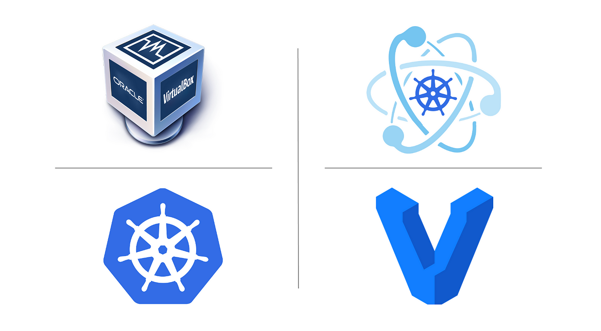

<h1 align="center">Kuebernetes Kubeadm Vagrant</h1>

<p align="center">
  
  
</p>

<p align="center">
  <a href="#-projeto">Projeto</a>&nbsp;&nbsp;&nbsp;|&nbsp;&nbsp;&nbsp;
  <a href="#-tecnologias">Tecnologias</a>&nbsp;&nbsp;&nbsp;|&nbsp;&nbsp;&nbsp;
  <a href="#-roadmap">Roadmap</a>&nbsp;&nbsp;&nbsp;
 
</p>

<p align="center">
  
</p>

## 💡 Projeto
Subir um Cluster simples utilizando vagrant com virtual box.

## ✨ Tecnologias

- Vagrant
- Virtualbox
- Kubernetes

## Virtualbox config

A versão mais recente do Virtualbox para Mac/Linux pode causar problemas.

Crie/edite o arquivo /etc/vbox/networks.conf e adicione o seguinte para evitar problemas relacionados à rede.

```console
* 0.0.0.0/0 ::/0
```

ou execute os comandos abaixo

```console
sudo mkdir -p /etc/vbox/
echo "* 0.0.0.0/0 ::/0" | sudo tee -a /etc/vbox/networks.conf
```

## Definir variável para o Kubeconfig

```console
cd configs
export KUBECONFIG=$(pwd)/config
```

ou você pode copiar o arquivo de configuração para o diretório .kube.

```console
cp config ~/.kube/
```

## Vagrant comandos

- Parar o cluster
```console
vagrant halt
```

- Iniciar ou reiniciar o cluster
```console
vagrant init
```

- Destruir o cluster
```console
vagrant destroy -f
```

- Acessar o controlplane
```console
vagrant ssh master
```

## 👣 Roadmap

- [x] [Criar um arquivo principal com as principais configurações a ser utilizada pelo `Vagrantfile`](config.yaml)
- [x] [Criar um `Vagrantfile` para subir o master e workers a ser utilizado pelo kubernetes](./Vagrantfile)
- [x] [Criar Scirpts para instalação e configuração do Cluster nas VMS](./scripts/README.md)